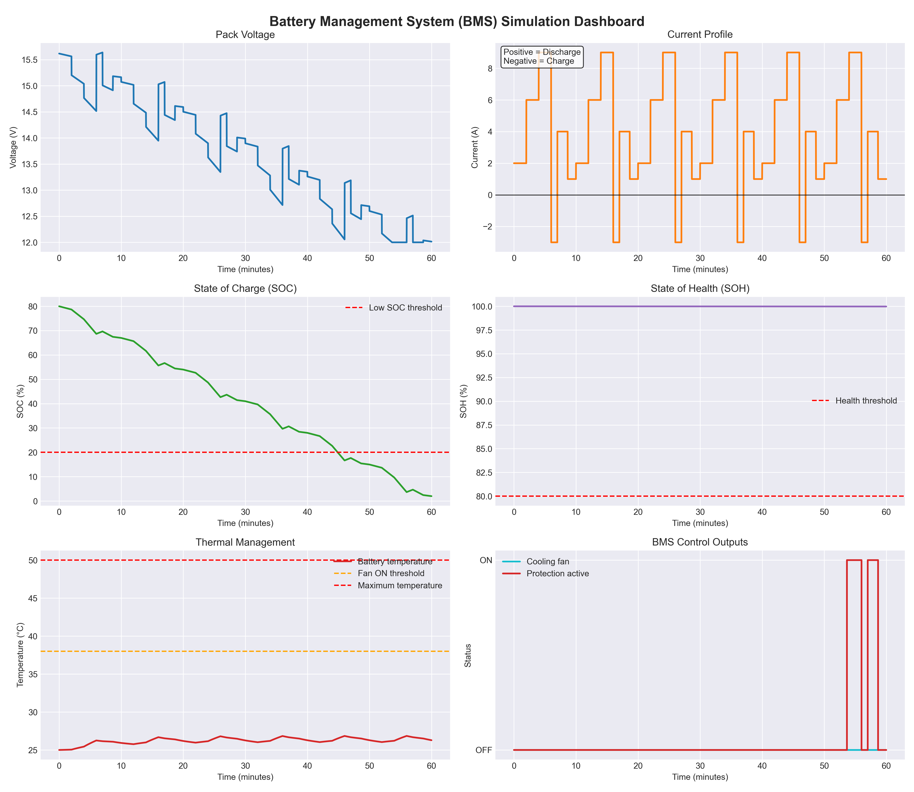

## Simulation Dashboard

The following dashboard was generated by running the Python BMS simulation.

## Sample Result

The simulation starts with an SOC of 80% and applies a repeated load profile containing discharge and charging intervals. During the 60-minute simulation, SOC decreases to about 2%, triggering a critical low-SOC warning. The temperature remains in a safe region, while SOH changes slowly because battery degradation occurs over many full charge-discharge cycles.
